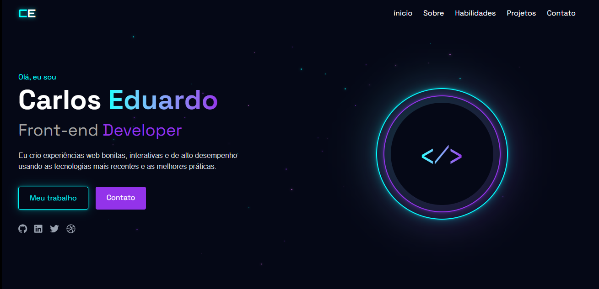

# 🌟 Meu Portfólio

Olá! Bem-vindo ao meu portfólio pessoal. Aqui você encontra uma coleção dos meus projetos em desenvolvimento frontend, onde eu mostro minhas habilidades em criar sites e apps web modernos e funcionais. Prepare-se para uma jornada visual incrível! ✨

## 👨‍💻 Sobre Mim

Desenvolvedor frontend focado em criar experiências web que funcionam. Trabalho principalmente com React e Next.js, sempre buscando código limpo e interfaces intuitivas. Apaixonado por transformar ideias em realidade digital! 🚀

## 🛠️ Tecnologias

- 
- 
- 
- 
- 

## 📂 Projetos

Este repositório documenta meus projetos em desenvolvimento frontend. Você encontrará desde aplicações completas com autenticação até componentes reutilizáveis e integrações com APIs.

## 🌟 Destaques

- **Interfaces Responsivas:** Sites que se adaptam perfeitamente a qualquer dispositivo.
- **Animações Suaves:** Usando Framer Motion para transições incríveis.
- **Código Limpo:** Sempre priorizando manutenibilidade e eficiência.

Sinta-se à vontade para explorar e entrar em contato! Vamos conversar sobre ideias e colaborações. 🤝

## 📞 Contato

[LinkedIn](https://www.linkedin.com/in/carloseduardo2003) | [Email](mailto:carlosvanziler50@gmail.com)

Desenvolvido por ❤️ Tenshi