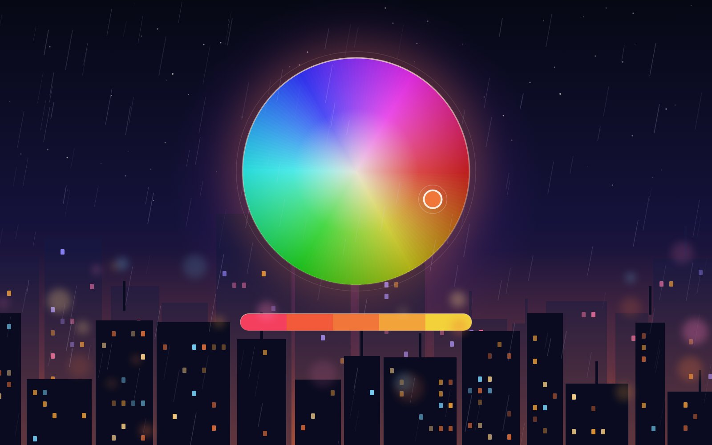

 

**Um céu escuro, duas estrelas douradas cruzando e algumas constelações. Dentro dele, o que eu construo.**

 

 

### [Visitar o site →](https://ceportfolio.vercel.app)

 

## O que é

Este é o meu portfólio: um site de uma página só, onde conto quem eu sou, o que sei fazer e o que já coloquei no ar.

Eu queria que ele tivesse cara de lugar, e não de currículo. Por isso o fundo é um céu noturno que acompanha você: as cores mudam de uma seção para outra, constelações se desenham devagar e, de vez em quando, duas estrelas douradas atravessam a tela juntas. Se você rolar a página enquanto elas passam, elas fazem a curva com você.

 

## Sobre mim

Sou o Carlos, de Curitiba. Hoje trabalho com suporte técnico e estudo inteligência artificial na pós. E, de vez em quando, gosto de construir coisas como esta.

O que me prende nisso é o detalhe: a cor certa, o movimento que não incomoda, a tela que funciona direitinho no celular. Quase sempre a parte mais difícil de um projeto, para mim, é o design. E é também a que eu mais gosto.

 

## Projetos

<table>
  <tr>
    <td width="50%" align="center" valign="top">
      
      <h3>Lumen</h3>
      
Para escolher cores e descobrir se elas funcionam para todo mundo, inclusive para quem enxerga cores de outro jeito.

      <a href="https://lumen-ashy.vercel.app/">Ver ao vivo</a> &nbsp;·&nbsp; <a href="https://github.com/Tenshiiz/Lumen">Código</a>
    </td>
    <td width="50%" align="center" valign="top">
      
      <h3>Clone do YouTube</h3>
      
Um clone feito para estudar, que acabou ganhando uma trilha sonora de Arcane.

      <a href="https://youtube-clone-tenshi.vercel.app">Ver ao vivo</a> &nbsp;·&nbsp; <a href="https://github.com/Tenshiiz/Youtube-clone">Código</a>
    </td>
  </tr>
</table>

 

## Vamos conversar?

[**LinkedIn**](https://www.linkedin.com/in/carlos-vanziler) &nbsp;·&nbsp; [**GitHub**](https://github.com/Tenshiiz) &nbsp;·&nbsp; [**E-mail**](mailto:carlosvanziler50@gmail.com)

 

<i>Que as estrelas iluminem seu caminho.</i>

 

<b>Para quem quer ver por dentro</b>

 

- **Stack:** Next.js 15, React 19, TypeScript, Tailwind CSS 4 e Framer Motion.
- **O céu:** auroras e estrelas animam só `transform` e `opacity`, e as estrelas douradas são desenhadas num canvas que só aparece durante o voo.
- **Movimento reduzido:** com `prefers-reduced-motion`, o voo e a paralaxe somem e o céu fica parado.
- **Acessibilidade:** menu navegável por teclado, `Esc` fecha e devolve o foco, botões com nome acessível.
- **Testes:** Playwright confere navegação, links, fontes, imagens, o céu e o layout em seis tamanhos de tela, de celular a 1920 px.

