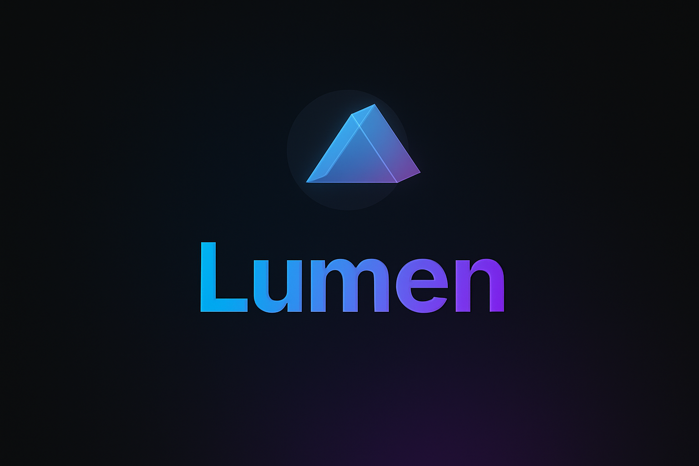

 

**Um céu escuro, duas estrelas douradas cruzando e algumas constelações. Dentro dele, o que eu construo.**

 

 

## O céu

O fundo da página inteira é um céu noturno que acompanha a rolagem. A estética é inspirada em **Genshin Impact**: estrelas gêmeas, constelações e brilhos dourados. É uma homenagem de fã; nenhum asset do jogo é usado, tudo é desenhado em CSS, SVG e canvas.

| Detalhe | O que acontece |
|---|---|
| **Estrelas gêmeas** | Duas estrelas douradas nascem no meio da tela e voam lado a lado, a uma distância fixa, deixando rastro. Se você rola a página, a trajetória curva junto: descer curva para baixo, subir curva para cima. |
| **Constelações** | Linhas finas se desenham devagar entre as estrelas, seguram e se apagam. |
| **Brilho em cruz** | O brilho de quatro pontas pulsa na cabeça das estrelas, nas constelações e na ponta da barra de cada título. |
| **Auroras** | Três manchas de luz mudam de cor conforme a seção: ciano no topo, roxo no meio, rosa no fim. |
| **Três profundidades** | Estrelas em camadas que rolam em velocidades diferentes. |
| **Fio de luz** | Entre as seções, um brilho atravessa devagar uma linha fina. |

Tudo é lento por escolha, e nada pisca. Com `prefers-reduced-motion`, o voo e a paralaxe não existem e o céu fica parado.

 

## Projetos

<table>
  <tr>
    <td width="50%" align="center" valign="top">
      
      <h3>Lumen</h3>
      Next.js · TypeScript · Tailwind CSS
        
      <a href="https://lumen-ashy.vercel.app/">Ver ao vivo</a> &nbsp;·&nbsp; <a href="https://github.com/Tenshiiz/Lumen">Código</a>
    </td>
    <td width="50%" align="center" valign="top">
      
      <h3>Clone do YouTube</h3>
      React.js · CSS
        
      <a href="https://youtube-clone-tenshi.vercel.app">Ver ao vivo</a> &nbsp;·&nbsp; <a href="https://github.com/Tenshiiz/Youtube-clone">Código</a>
    </td>
  </tr>
</table>

 

## Por dentro

- **Teclado e leitor de tela:** menu navegável por teclado, `Esc` fecha e devolve o foco, botões com nome acessível.
- **Movimento com educação:** Framer Motion e o céu obedecem ao `prefers-reduced-motion` do sistema.
- **Leve:** a animação do céu não força layout (move `transform`, `opacity` e o traço de SVGs pequenos), e o canvas das estrelas gêmeas só é exibido e desenhado durante o voo.
- **Testado de verdade:** Playwright confere navegação, links, fontes, imagens, o céu e o layout em seis tamanhos de tela, de celular a 1920 px.

 

## Vamos conversar?

[**LinkedIn**](https://www.linkedin.com/in/carloseduardo2003) &nbsp;·&nbsp; [**GitHub**](https://github.com/Tenshiiz) &nbsp;·&nbsp; [**E-mail**](mailto:carlosvanziler50@gmail.com)

Feito por Carlos Eduardo

